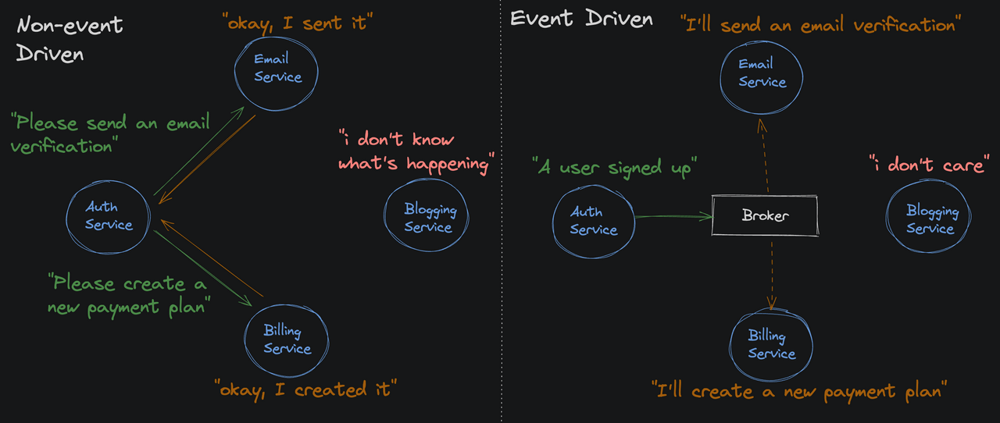
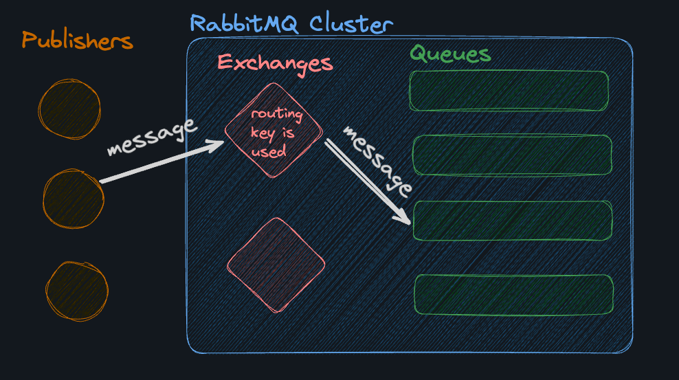
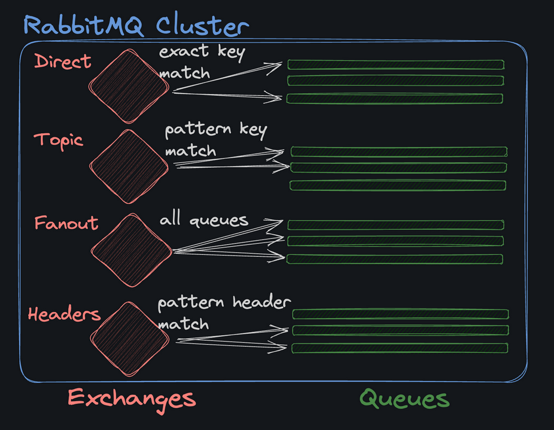

Pub/Sub systems are often used to enable ["event-driven design", or "event-driven architecture"](https://aws.amazon.com/event-driven-architecture/). An event-driven architecture uses events to trigger and communicate between decoupled systems.

A [message broker](https://www.ibm.com/think/topics/message-brokers) is a middleman that allows different parts of the system to communicate without knowing about each other. Everyone is friends with the message broker, and the message broker is friends with everyone.

### Exchanges and Queues
In RabbitMQ, an [exchange](https://www.rabbitmq.com/tutorials/amqp-concepts#exchanges) is where publishers send messages, typically with a routing key.

The exchange takes the message, uses the routing key as a filter, and sends the message to any queues that are listening for that routing key.

#### Types of Exchanges
RabbitMQ supports several types of exchanges, each serving a different routing strategy.

