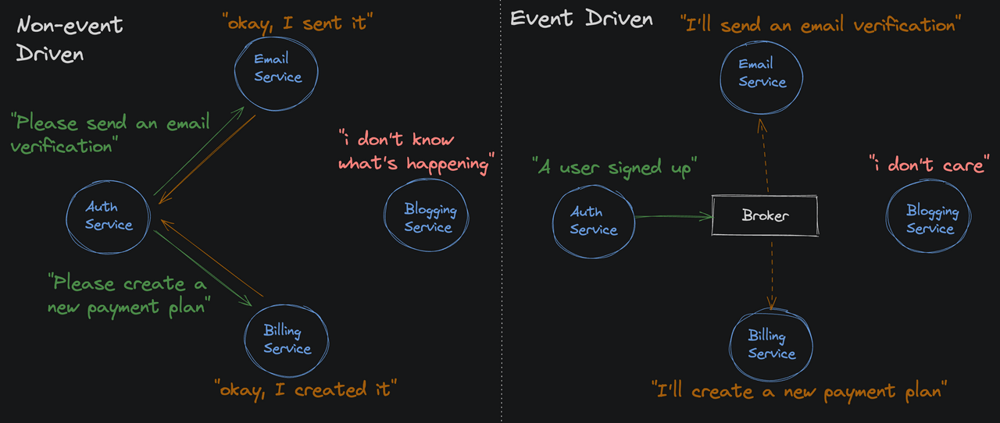
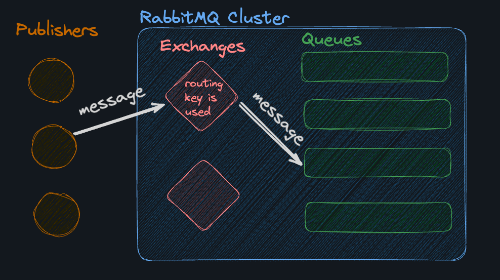
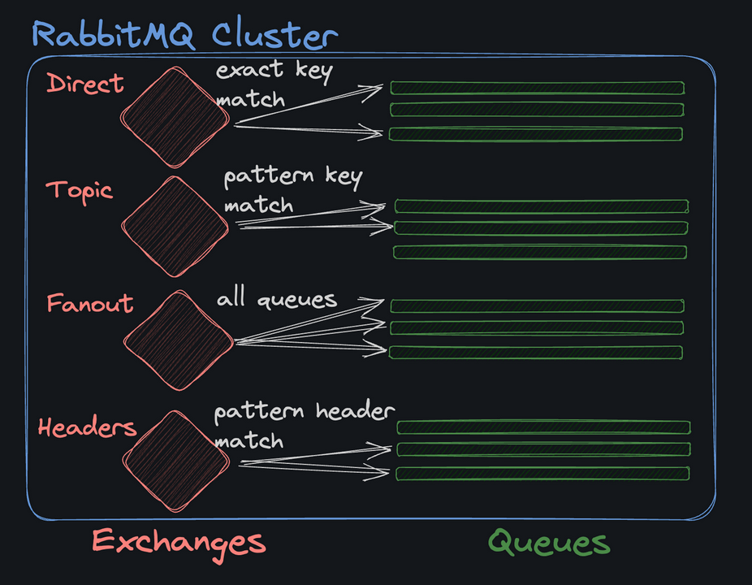
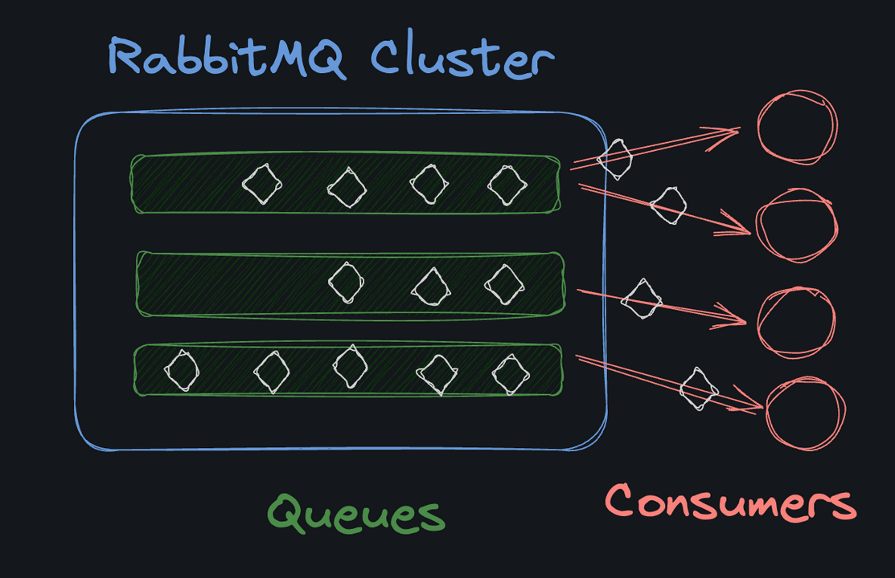
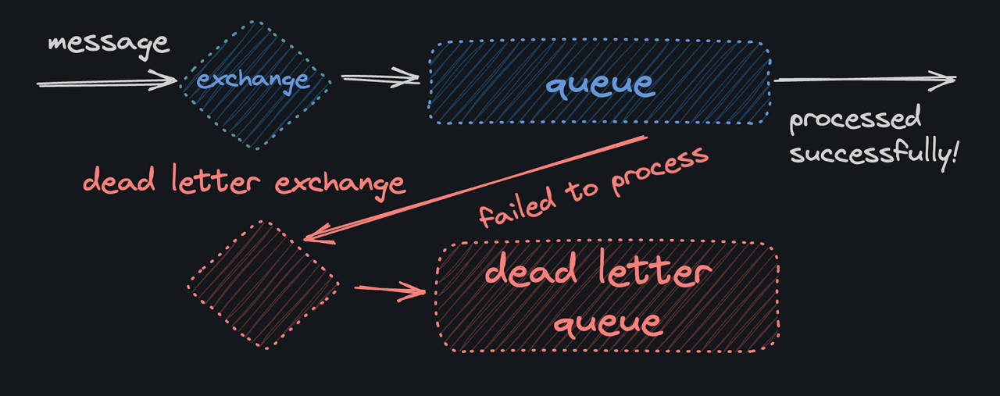

	Pub/Sub systems are often used to enable ["event-driven design", or "event-driven architecture"](https://aws.amazon.com/event-driven-architecture/). An event-driven architecture uses events to trigger and communicate between decoupled systems.

A [message broker](https://www.ibm.com/think/topics/message-brokers) is a middleman that allows different parts of the system to communicate without knowing about each other. Everyone is friends with the message broker, and the message broker is friends with everyone.

### Exchanges and Queues
In RabbitMQ, an [exchange](https://www.rabbitmq.com/tutorials/amqp-concepts#exchanges) is where publishers send messages, typically with a routing key.

The exchange takes the message, uses the routing key as a filter, and sends the message to any queues that are listening for that routing key.

#### Types of Exchanges
RabbitMQ supports several types of exchanges, each serving a different routing strategy.

### Queues
Queues are where the messages are stored after being routed through the exchange. Messages sit in a queue until they are consumed by a subscriber.

Durability
Queues can be ["durable"](https://www.rabbitmq.com/docs/queues#durability) or "transient". Durable queues survive a RabbitMQ server restart, while transient queues do not.

The metadata of a durable queue is stored on disk, while transient queues are only stored in memory.

### Consumers

In all seriousness, nothing happens after the message arrives in the queue!

This is where [consumers](https://www.rabbitmq.com/docs/consumers#basics) come in. Consumers are programs (like our "client" program) that connect to queues and pull the messages out of them.

### Dead Letter Exchanges and Queues
In an asynchronous system like RabbitMQ, the sender and receiver are decoupled. The sender doesn't need to know if the message was successfully delivered to the receiver. That has benefits, like simplicity and performance, but it also means that the chance of bugs increases.

To address this, it's common in PubSub systems to aggregate messages that fail to be processed into a dead letter queue. Queues can be configured to send messages that fail to be processed to a dead letter exchange, which then routes the message to a dead letter queue.

